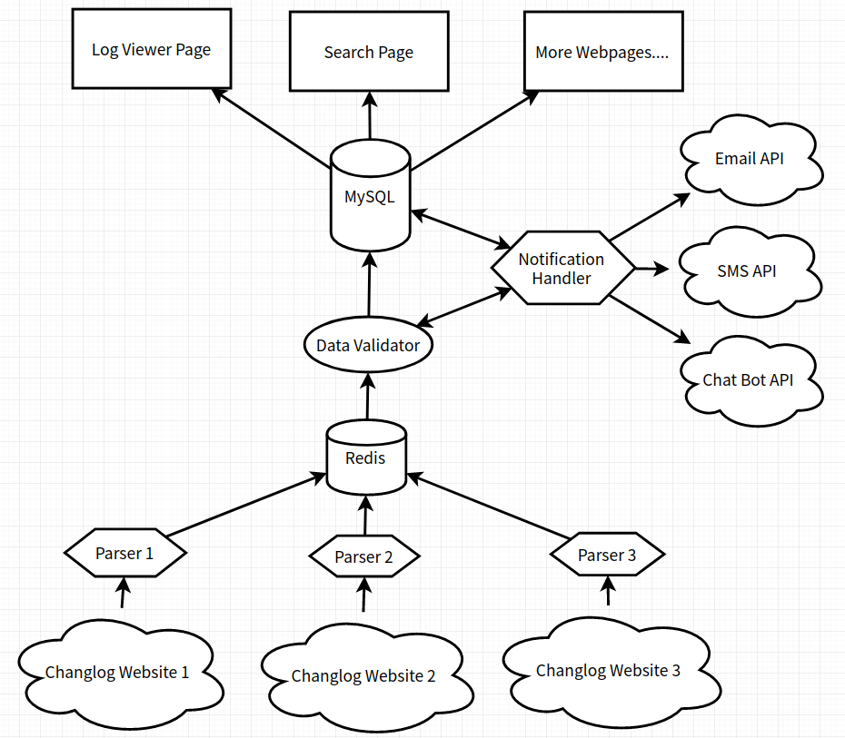

# ChangeLogger
## Description

A website for tracking changelogs.

## Functionality

- Parse update logs from softwares' website.
- Store update logs to database.
- A web page to show details of softwares.
- A user center that allow users to subscribe.
- Integrate RSS feed/Mail Notification / Text Notification / Slack Bot / Telegram Bot.

## Running Flow



## Tech Stack

- Python3 + BeautifulSoup4
- MySQL
- Redis
- PHP
- BootStrap 4

## Development
### Requirement
- Redis Server
- MySQL 5.x
- Python 3
- PHP 7.3.x

### Backend
```bash
git clone https://github.com/maoyuwang/ChangeLogger
cd ChangeLogger
python3 -m pip install -r requirements.txt
mysql -u MYSQL_USERNAME -pMYSQL_PASSWORD < init.sql # Import database
vim config.py.example # Config database and API keys
```
### Frontend
```bash
cd Website
cp config.php.example config.php
vim config.php # Config database and Redis
```
## License

The 3-Clause BSD License